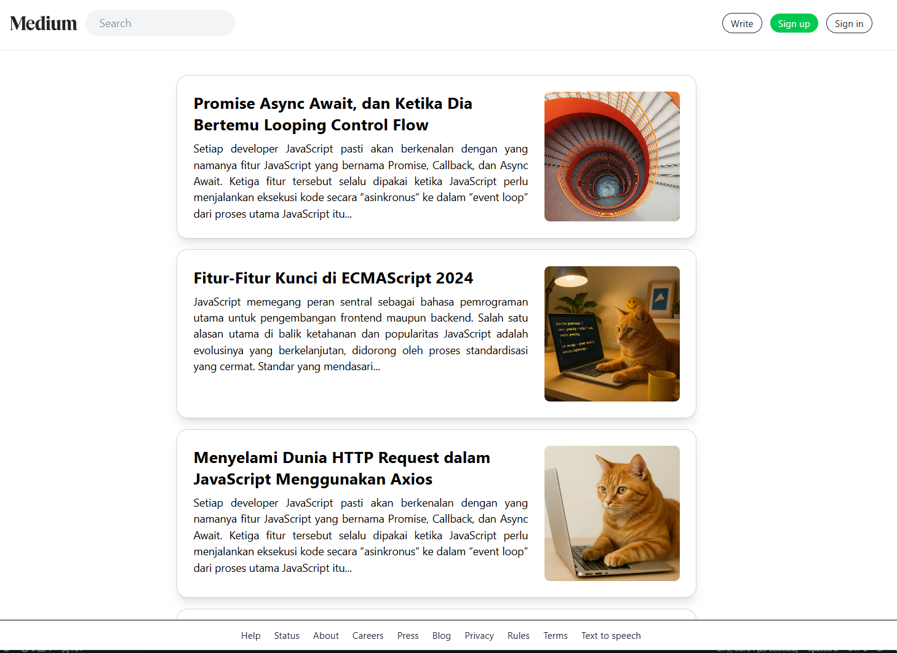
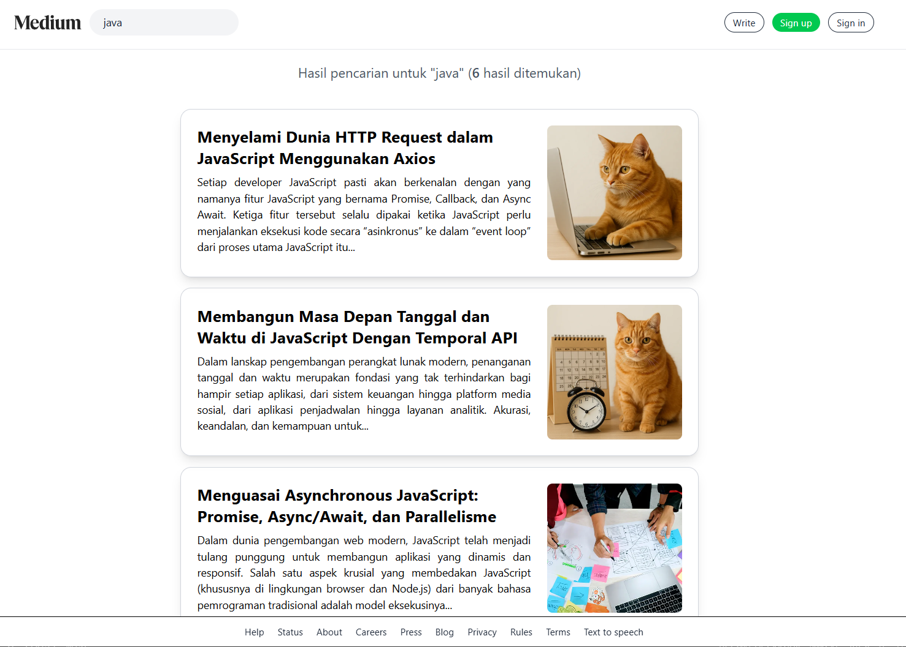
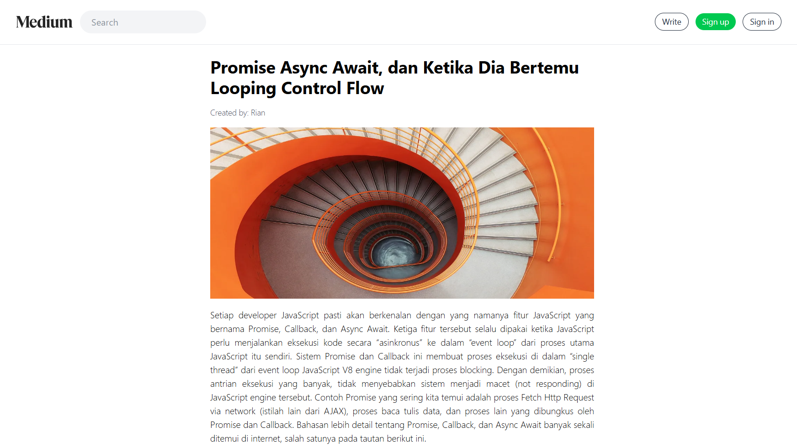

# React Example Project

This repository contains React project Minitask with React useParam, useState, useEffect, example. This project makes the web resemble a medium website with 2 pages, namely the article page and the detailed article page.

## Preview







## How to Run

### Manual

1. Clone this project

```bash
git clone https://github.com/yusufbahtiarr/fgo24-react-medium.git
```

2. Enter the project directory

```bash
cd fgo24-react-medium
```

3. Install the Depedencies

```bash
npm install
```

4. Run the project

```bash
npm run dev
```

5. Project will running on http://localhost:8080

### With Docker

1. Clone this project

```bash
git clone https://github.com/yusufbahtiarr/fgo24-react-medium.git
```

2. Enter the project directory

```bash
cd fgo24-react-medium
```

3. Build image

```bash
docker build . -t reactmedium:latest
```

4. Run image with docker

```bash
docker run -p 8080:80 -d reactmedium:latest
```

5. Visit your app in http://localhost:8080

## Dependencies

To develop this app, we are using some dependencies:

- ReactJS
- TailwindCSS
- Axios
- Lodash
- React Router Dom

And frontend tooling, the one and only:

- Vite

## How to Contribute

Please open PR to contributed to this project, i will review and merge if its needed.

## License

This project following MIT License

## Copyright

&copy; 2025 Kodacademy
